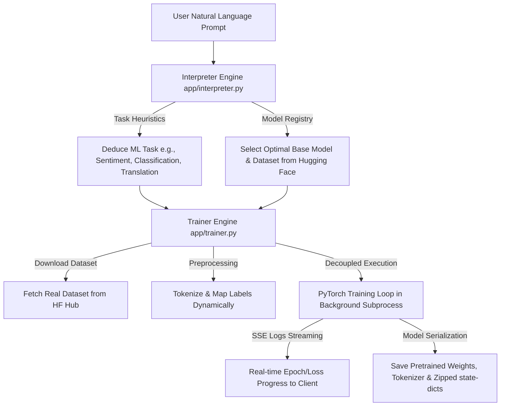
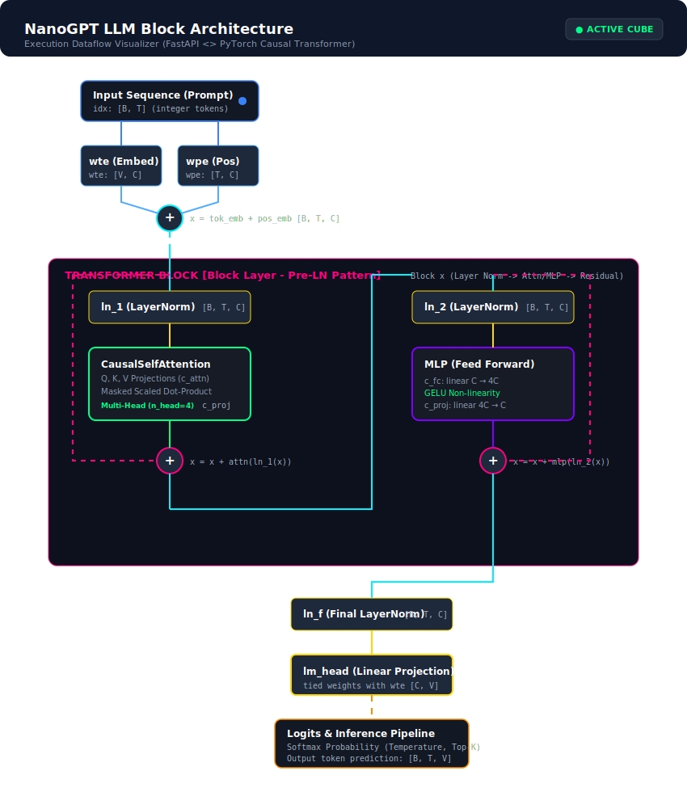

# 🧊 Reflex Cube
### Prompt-Driven Generative ML & 3D Intelligence Platform

<p align="center">
  
  
  
  
  
  
  
</p>

<p align="center">
  
  
  
  
  
  
  
  
</p>

---

## 🚀 Overview

**Reflex Cube** is a modular AI-powered platform designed to build, run, and visualize custom AI models and intelligent applications directly from natural language prompts. Combining deep learning backends with an immersive, interactive 3D WebGL user interface, it provides developers and researchers with a comprehensive playground for model generation, log monitoring, and intelligent agent simulation.

At the core of the platform is the **"Cube Architecture"**: independent, task-oriented AI modules (Cubes) executing isolated business logic, data evaluation, and ML predictions.

---

## 🎯 Primary Objective: Prompt-to-Model Generation

The main goal of Reflex Cube is **dynamic, automated deep learning model compilation directly from natural language prompts**. Instead of manually configuring training scripts, preprocessing text, or setting up models, users write a prompt describing what they want (e.g., *"build a sentiment analysis model for movie reviews"*), and the system handles the rest.

### 🔄 The Prompt-to-Model Pipeline



### ⚙️ Deep Dive into the Pipeline Components:
1. **Prompt Parsing & Task Resolution ([interpreter.py](file:///d:/Projects/reflexcube-v2/backend/app/interpreter.py))**:
   - Parses the query to classify the required task (e.g., `summarization`, `translation`, `text-generation`, `sentiment-analysis`, `text-classification`, `token-classification`).
   - Selects a high-performance pre-trained base model and dataset (e.g., `imdb`, `ag_news`, `squad`, etc.) from Hugging Face, with fallback resolvers for stability.
2. **Dynamic Data Loading ([trainer.py](file:///d:/Projects/reflexcube-v2/backend/app/trainer.py))**:
   - Enforces downloading real-world datasets using Hugging Face's `load_dataset` (no mock data).
   - Maps column fields (e.g., `text`, `document`, `context` vs `label`, `sentiment`, `ner_tags`) to model inputs dynamically.
3. **Decoupled Asynchronous Training**:
   - Spawns background subprocesses to run the training loops (`train_worker.py`). This prevents global interpreter lock (GIL) blockages in the primary FastAPI server.
   - StreamLog callbacks write jsonl logs which stream live loss and epoch progress to the frontend using Server-Sent Events (SSE).
4. **Serialization & Archiving**:
   - Saves final checkpoints locally inside the persistent `storage/` volume.
   - Archives tokenizer configurations and state dict weights in standard `.zip` files ready for production deployment.

---

## 🧠 The LLM Training Sandbox (Forge Cube)

For custom-trained autoregressive models, the platform features the **Forge Cube**, allowing users to design, train, and test custom causal language models (**NanoGPT**) from scratch.

### 📊 NanoGPT Block Architecture



### 🧱 Architectural Sub-components

As defined in the core [model.py](file:///d:/Projects/reflexcube-v2/backend/app/cubes/forge_core/model.py):

* **`CausalSelfAttention`**:
  - Projects inputs into Query ($Q$), Key ($K$), and Value ($V$) representations.
  - Implements multi-head split calculations transposed for parallel head computation.
  - Utilizes a causal triangular mask buffer (`tril`) to ensure autoregressive tokens cannot attend to future slots.
* **`MLP` (Multi-Layer Perceptron)**:
  - Projects context embeddings from $C \to 4C$ via a linear layer.
  - Applies **GELU** (Gaussian Error Linear Unit) activations and projects back to dimension $C$.
* **`Block` (Transformer Block)**:
  - Employs **Pre-Layer Normalization** (Pre-LN) layout for training stability.
  - Links inputs around attention and feed-forward nets using double residual bypass routes.
* **`NanoGPT`**:
  - Joins Token (`wte`) and Positional (`wpe`) embeddings.
  - Employs **Weight Tying** between the input embedding and final language modeling head (`lm_head.weight = wte.weight`) to optimize parameters.

---

## 🕹️ Interactive 3D WebGL Canvas

Reflex Cube provides a premium, real-time dashboard visualizing the model training pipeline:
* **Interactive 3D Grid**: Built on React Three Fiber (`@react-three/fiber`), allowing direct rotation, zoom, and selection of active Intelligence Cubes.
* **Log Stream Visualizer**: Streams standard output and training epoch loss curves in a stylized retro HUD terminal using Recharts and Framer Motion.

---

## 🧠 The 15 Intelligence Cubes Registry

The registry contains 15 active modules interacting with the main gateway:

| Icon | Cube Name | Primary Function | Key Features & Implementation |
| :---: | :--- | :--- | :--- |
| 🔨 | **Forge Cube** | LLM Training Sandbox | Architect, configure (layers, attention heads), and train mini language models from scratch. |
| 🧑‍💼 | **Talent Cube** | Recruitment & CV Parsing | Batchscreens candidate resumes against dynamic job descriptions, outputting match scores and hire recommendations. |
| 🔗 | **Nexus Cube** | Memory & Relational context | Collects continuous contextual knowledge and acts as a secondary brain database. |
| ⚖️ | **Legal Cube** | Contract Compliance | Parses legal documents, highlights liabilities, and evaluates contract compliance scores. |
| 🍳 | **Chef Cube** | Culinary AI | Analyzes food descriptions or ingredients and generates safety analysis and recipe steps. |
| 📈 | **Alpha Cube** | Financial Analysis | Fetches market details and calculates P/E, market capitalization, ratings, and investment theses. |
| 💼 | **Career Cube** | Career Growth | Builds personalized career paths and analyzes trajectory growth steps. |
| 🏷️ | **Brand Cube** | Marketing & Identity | Generates copy, corporate branding, and logo guidelines. |
| 🏋️ | **FitPal Cube** | Biometrics & Health | Designs custom workout regimens and monitors fitness metrics. |
| ✈️ | **Travel Cube** | Travel Planner | Generates comprehensive travel itineraries, budget estimates, and weather guides. |
| 🛡️ | **Sentinel Cube** | Cybersecurity & WAF | Monitors logs, simulates attack prevention, and manages custom firewall rules. |
| 📓 | **Ledger Cube** | Financial Forensic Audit | Compares invoice details with bank transactions, flagging discrepancies and fake vendors. |
| 👁️ | **Vision Cube** | Neural Network Lab | Interactive image dataset loader with data augmentation configs, custom classification training, and X-Ray visualizer. |
| 💭 | **Dream Cube** | Generative Art & Ideation | Custom generative model pipeline for image-text prompt synthesis. |
| 🔍 | **Lens Cube** | OCR & Content Summarization | Performs optical character recognition on uploaded images and extracts clean text details. |

---

## 🛠️ Technology Stack

### Frontend UI / Visuals
- **Framework**: React 18, Vite, TypeScript
- **3D Render**: Three.js, React Three Fiber, React Three Drei
- **State Management**: Valtio
- **Animations**: Framer Motion, GSAP (Lenis Smooth Scroll)
- **Visualizations**: Recharts, TailwindCSS
- **Design System**: Shadcn UI (Radix Primitives)

### Backend Services
- **API Gateway**: Python 3.10+, FastAPI, Uvicorn
- **Execution Concurrency**: `subprocess.Popen` task delegation for CPU-bound training tasks.
- **Deep Learning**: PyTorch, Hugging Face Transformers
- **Database**: SQLite (via SQLAlchemy) configured with volume persistence.

---

## 📂 System Directory Structure

```text
📦 ReflexCube
 ┣ 📂 backend
 ┃ ┣ 📂 app
 ┃ ┃ ┣ 📂 cubes           # The 15 Intelligence Cubes (e.g. sentinel.py, forge.py)
 ┃ ┃ ┣ 📂 routes          # Gateway API endpoints
 ┃ ┃ ┣ 📂 utils           # AI routers and db connectivity
 ┃ ┃ ┣ 📜 api.py          # FastAPI server entry point
 ┃ ┃ ┣ 📜 brain.py        # Relational inference logic
 ┃ ┃ ┣ 📜 models.py       # SQLAlchemy DB schemas
 ┃ ┃ ┗ 📜 trainer.py      # ML Model generation pipelines
 ┃ ┣ 📂 tests             # Verification tests
 ┃ ┣ 📜 train_worker.py   # Background process runner for ML models
 ┃ ┗ 📜 requirements.txt  # Python environment requirements
 ┣ 📂 frontend
 ┃ ┣ 📂 src
 ┃ ┃ ┣ 📂 components      # UI Bento grids, footers, & cubes pages
 ┃ ┃ ┃ ┗ 📂 cubes         # Frontend views for the 15 Registry cubes
 ┃ ┃ ┣ 📂 pages           # Router routes (e.g. CubePage, Services, Home)
 ┃ ┃ ┣ 📂 lib             # Core API wrappers & utilities
 ┃ ┃ ┣ 📜 App.tsx         # Route mappings
 ┃ ┃ ┗ 📜 main.tsx        # Render entrypoint
 ┃ ┗ 📜 eslint.config.js  # Code quality rules
 ┣ 📂 storage             # Output folder for zip models and SQLite DB files
 ┣ 📜 docker-compose.yml  # Deployment configuration
 ┣ 📜 llm_architecture.svg# Standalone animated SVG architecture graph
 ┗ 📜 README.md           # Documentation
```

---

## 🔌 API Reference

### 1. Training & Inference Models
* `POST /api/models/create` — Queues a prompt to start background model generation.
  * *Request*: `{ "name": "Model-Name", "prompt": "Text description...", "task": "classification" }`
  * *Response*: `{ "status": "queued", "job_id": "job-uuid" }`
* `GET /api/training/status/{job_id}` — Returns current compilation progress, epoch metrics, and status.
* `GET /api/logs/{job_id}` — Text/Event-Stream (SSE) logs streamed directly from standard out.
* `POST /api/models/{job_id}/predict` — Runs custom text inference with the trained model.
  * *Request*: `{ "text": "Inference input" }`
* `GET /api/models/download-zip-stream/{job_id}` — Streams the compiled `.pt` state dict zip archive.

### 2. Direct Cube Actions
* `POST /api/cubes/run` — Executes actions on a specific registered Cube.
  * *Payload Example (yFinance audit)*: `{ "cube_id": "alpha", "input": { "text": "TSLA" } }`
  * *Payload Example (Forensic check)*: `{ "cube_id": "ledger", "input": { "invoices": "...", "bank_feed": "..." } }`

---

## 🚀 Getting Started

### Prerequisites
- **Node.js 18+**
- **Python 3.10+** (with pip)
- **Git & Git LFS** (Required to pull local `.pt` test weight cache)

### 📦 Git LFS Installation
Ensure you pull the large tensor files before running the project:
```bash
git lfs install
git lfs pull
```

### 1. Backend Launch
Setup a virtual environment and launch FastAPI:
```bash
cd backend
python -m venv venv

# Activate venv
# On Windows:
venv\Scripts\activate
# On macOS/Linux:
source venv/bin/activate

# Install dependencies
pip install -r requirements.txt

# Run server
uvicorn app.api:app --reload --host 0.0.0.0 --port 8000
```
FastAPI Swagger will be live at `http://localhost:8000/docs`.

### 2. Frontend Launch
Install dependencies and run the Vite dev server:
```bash
cd frontend
npm install
npm run dev
```
Open `http://localhost:5173` to explore the dashboard.

### 3. Running Stability Tests
Ensure correct routing and fallback connectivity:
```bash
python backend/tests/verify_stability.py
```

---

## 🤝 Contributing
Feel free to open issues or submit PRs to expand the AI Cube Registry, improve WebGL rendering, or build additional deep learning models.

## 📄 License
MIT License.
