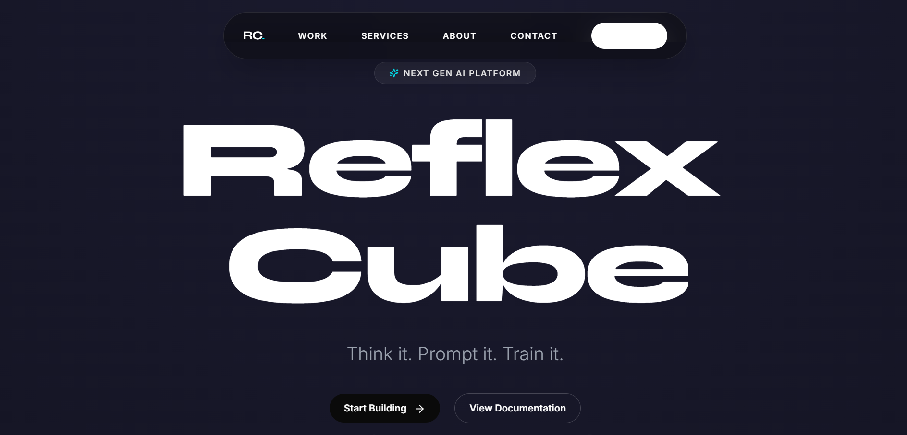
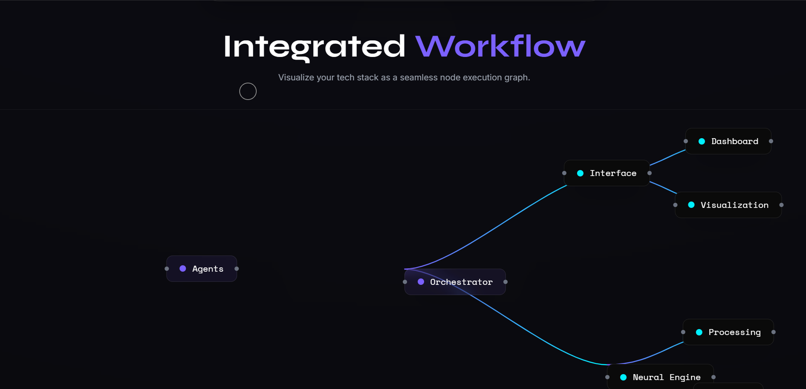
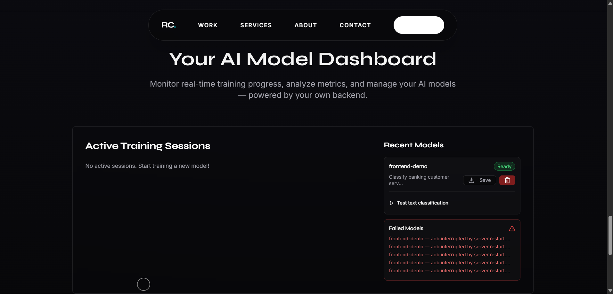
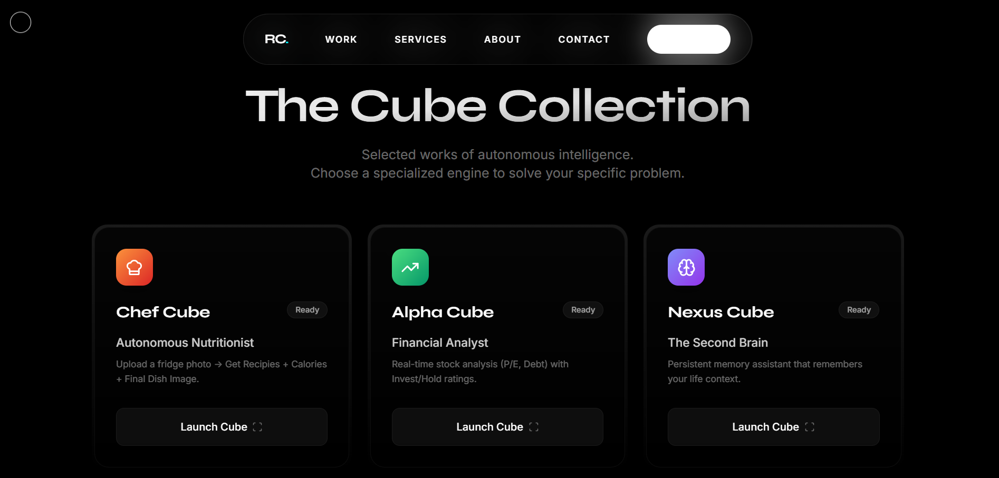
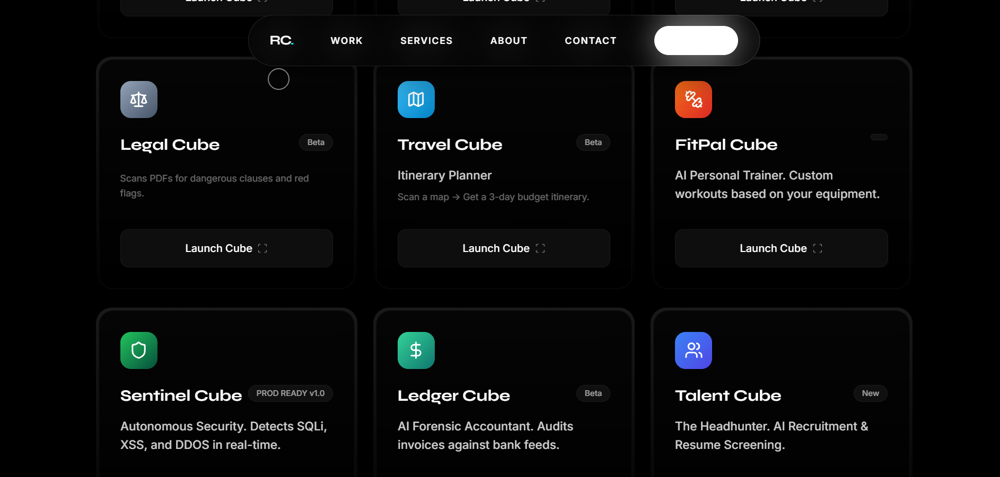
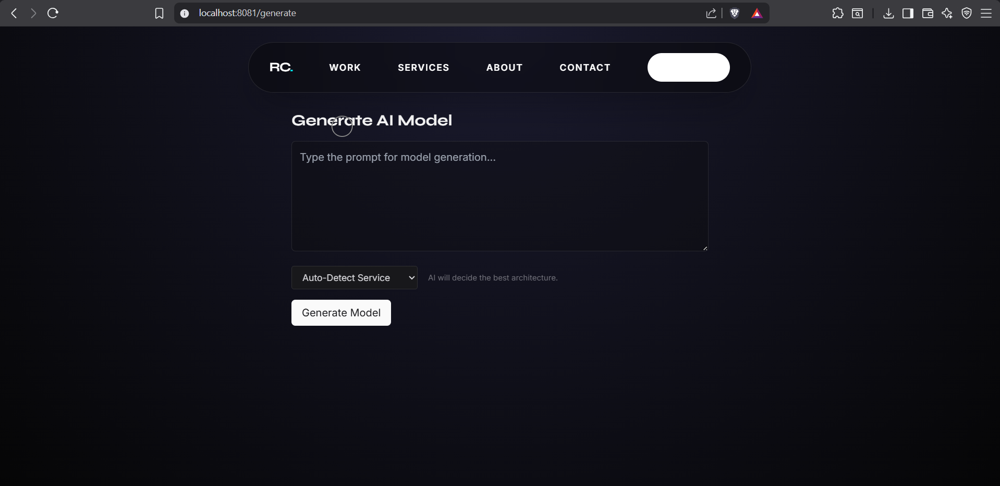

# 🧊 Reflex Cube
### Prompt-Driven Modular AI Systems for Real-World Intelligence

<p align="center">
  
  
  
  
  
  
  
  
</p>

<p align="center">
  
  
  
  
  
  
  
  
</p>

---

## 🚀 Overview

**Reflex Cube** is a modular AI-powered platform that enables building **AI models and AI applications directly from prompts**, primarily focused on **Natural Language Processing (NLP)**.

The system is built using a **Cube Architecture**, where each **Cube** represents an independent AI module or intelligent agent. This design allows Reflex Cube to scale across **startup products, business automation, AI services, and research experimentation**.

---

## 🧠 Cube Architecture

Each **Cube** is:
- Independent  
- Task-specific  
- API-driven  
- Pluggable and extensible  

```text
Frontend (React + 3D UI)
        ↓
FastAPI Gateway
        ↓
 ┌──────────────────────┐
 │     Cube Engine      │
 │──────────────────────│
 │ Talent Cube          │
 │ Nexus Cube           │
 │ Future Cubes         │
 └──────────────────────┘
        ↓
Persistence & LLM APIs

```
✨ Key Capabilities

Prompt-driven AI model creation

Modular AI agents (Cubes)

AI-powered decision workflows

Interactive UI with 3D visualization

High-performance FastAPI backend

Dockerized deployment

Git LFS support for large AI artifacts

🧩 Cubes
🧑‍💼 Talent Cube — The Headhunter

Extracts evaluation criteria from job descriptions

Screens and ranks resumes in batch

Supports role-specific training and evaluation

🧠 Nexus Cube — The Persistent Second Brain

Stores user facts and contextual memory

Retrieves information via natural language queries

Acts as a mock long-term memory layer

🛠️ Technology Stack
Frontend
<p>  React (Vite)  TypeScript  TailwindCSS  Three.js </p>
Backend
<p>  Python  FastAPI </p>

AI / ML
<p>  TensorFlow  PyTorch </p>

DevOps
<p>  Docker  Git LFS </p>


🚀 Getting Started
Prerequisites

Python 3.10+

Node.js 18+

Docker (optional)

Backend Setup
python -m venv venv
source venv/bin/activate
pip install -r backend/requirements.txt
uvicorn app.api:app --reload

Frontend Setup
cd frontend
npm install
npm run dev

Backend Setup (Uvicorn)
python -m venv venv
source venv/bin/activate
pip install -r backend/requirements.txt
uvicorn app.api:app --reload


Backend runs on:

http://localhost:8000
Docker (Recommended)
docker-compose up --build

📦 Git LFS

This repository uses Git LFS for large AI artifacts.

git lfs install
git lfs pull

🖼️ Project Gallery
<p align="center">  </p> <p align="center">  </p> <p align="center">  </p> <p align="center">  </p> <p align="center">  </p> <p align="center">  </p>
🔮 Roadmap

Cube marketplace

User-defined cube creation

Fine-tuning support

Vector database integration

Authentication and multi-tenancy

Cloud deployment templates

🤝 Contributing

Contributions are welcome.
Please open an issue or submit a pull request.

📄 License

License information will be added soon.

⭐ Final Note

Reflex Cube focuses on clean architecture, modular AI systems, and real-world usability.
It is designed for developers, researchers, startups, and businesses building intelligent systems.
